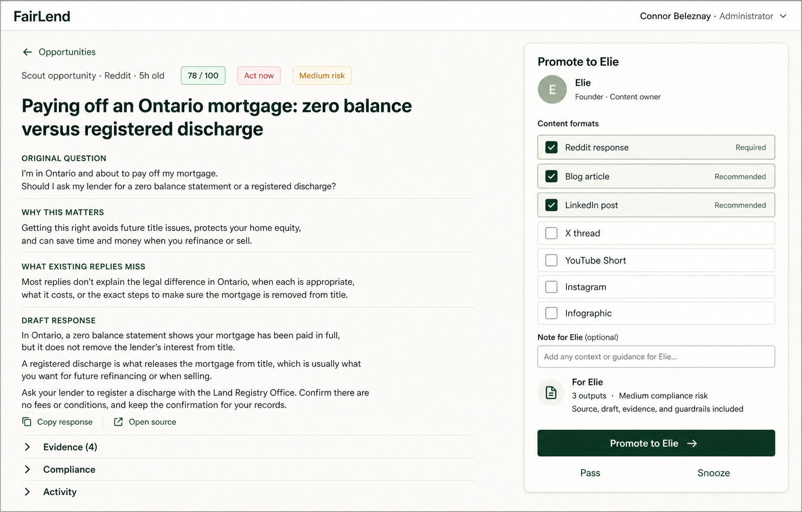
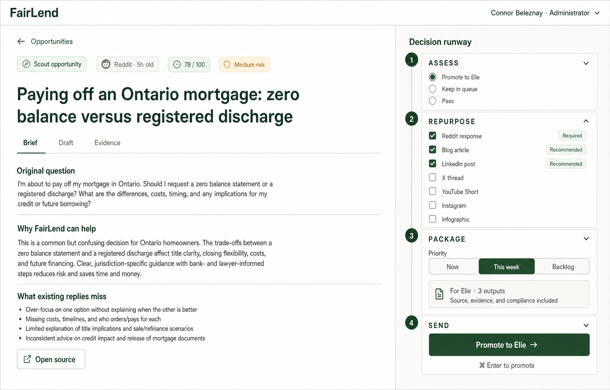
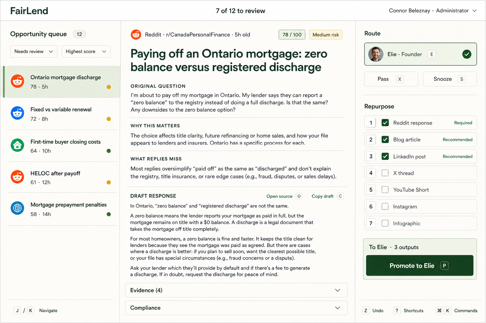
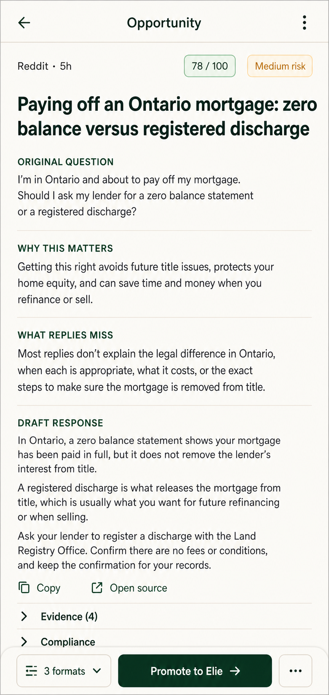
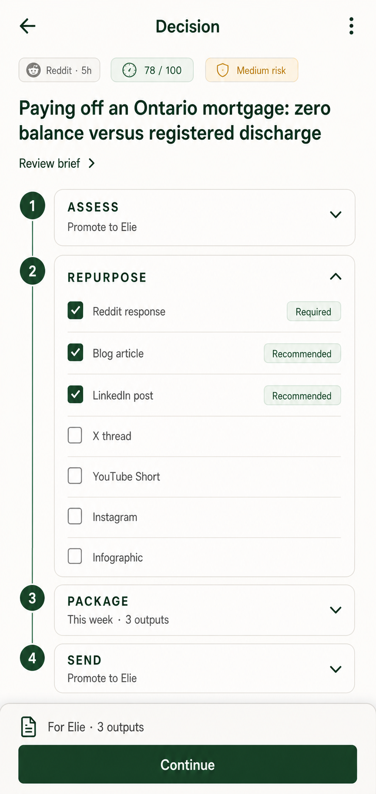
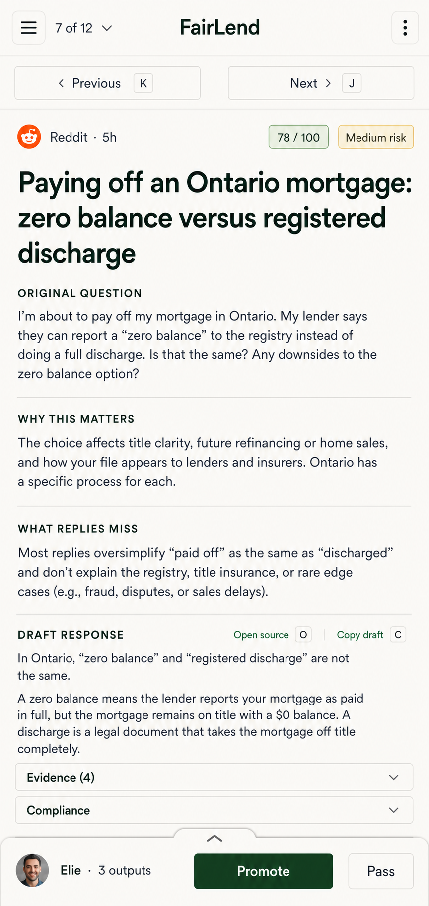

# Operator Content Request Interface

## Generated mockups

Each concept is a separate full-screen asset, not a combined comparison board.

### Opportunity Command Center



### Decision Runway



### Triage Inbox



The opportunity queue rail is collapsible. It opens by default for wide-screen queue-review sessions, remembers the operator's preference, and collapses to a count-bearing queue trigger when reading width or focus is more valuable.

### Mobile Opportunity Command Center



### Mobile Decision Runway



### Mobile Triage Inbox



## Decision

Replace the current stack of record-management cards with the **Triage Inbox** on desktop and mobile, built around one workflow:

1. Assess the scout opportunity.
2. Decide whether it deserves Elie's attention.
3. Select the content formats worth producing.
4. Promote the complete package to Elie.

The primary interface must speak in operator intent. It must not require the operator to understand assignment principals, deliverable versions, retention, disposition, confirmation receipts, or public-share records.

The selected interface is **Design C: Triage Inbox**. It combines a collapsible opportunity queue, a continuous assessment canvas, a persistent routing and repurposing surface, keyboard-first controls, immediate undo, and automatic queue progression. On mobile, the queue is collapsed by default behind a count-bearing drawer trigger and the routing surface becomes a bottom sheet plus sticky action bar.

## Why the current interface fails

The current detail route renders the business workflow as six independent administrative modules:

1. Lifecycle and related work.
2. Deliverable versions.
3. Delivery targets.
4. Public sharing.
5. Assignment.
6. Semantic conflict resolution when required.

This is a persistence-model interface. The operator has to infer how multiple low-level mutations combine into the business outcome they want.

Specific friction:

- **“Accountable assignee” is internal vocabulary.** A value such as `workos-agent:codex-dev-opportunity-automation · agent editor` identifies a principal, not a person or an operator outcome.
- **The page has no dominant action.** Promotion, assignment, delivery setup, and public sharing appear equivalent even though they are not equivalent in the operator workflow.
- **Repurposing is modeled as manual delivery administration.** The operator should choose formats, not create destinations and wire deliverables by hand.
- **The action surface is below the reading surface.** Operators must scroll through the full scout report before reaching controls, then continue across unrelated cards.
- **Version promotion leaks into triage.** The normal case should promote the current candidate automatically.
- **Exceptional administration competes with the happy path.** Expiry, archival, public links, watchers, linked follow-ups, and version history are valuable but uncommon during opportunity review.
- **The visual hierarchy treats every subsystem as a card.** The result is a form stack rather than a decision workspace.

## Explored designs

### Design A: Opportunity Command Center

The request becomes a two-column decision workspace. The left side is a continuous opportunity brief. The right side is a sticky rail containing every operation required to promote the opportunity.

```tsx
<OpportunityCommandCenter>
  <OpportunityBrief />
  <FounderDecisionRail />
  <AdvancedRequestTools />
</OpportunityCommandCenter>
```

Normal usage:

1. Scan score, freshness, source engagement, response gap, and risk.
2. Review the source, evidence, and any prepared draft. A draft is optional because
   routing can create the work Elie needs to complete.
3. Toggle useful repurposing formats.
4. Press **Promote to Elie**.

It hides identity resolution, eligible version promotion, deliverable creation,
request state changes, notification, audit history, and idempotent retry behavior.

The design is extremely deep: one small operator action hides substantial orchestration. Its trade-off is that it intentionally optimizes for Elie as the normal recipient. Reassignment remains available as an exception.

### Design B: Decision Runway

The action rail is a four-checkpoint pipeline:

1. Assess: promote, keep in queue, or pass.
2. Repurpose: select formats.
3. Package: review founder summary and priority.
4. Send: promote to Elie.

The design prevents incomplete promotion and is easy for a new operator to learn. Completed checkpoints can collapse for speed.

Its trade-off is ceremony. A power user who already understands the decision should not have to advance through four visible steps on every request. The useful part is the compact preflight summary, not the wizard structure.

### Design C: Triage Inbox

The page becomes a three-column high-throughput inbox: queue, assessment canvas, and decision rail. Keyboard commands cover navigation, source opening, channel selection, promotion, passing, snoozing, and undo.

The left queue rail is collapsible. When collapsed, a persistent queue trigger retains the current position and remaining count, while previous/next navigation remains available without reopening the rail.

This is the strongest model when the primary job is reviewing many opportunities in one session. It also provides the best route to batch actions.

Its larger information-architecture scope is intentional: queue context and rapid progression are part of the operator's primary job, not optional decoration on a record-detail page. The collapsible queue preserves reading width when the operator wants focus.

## Comparison

The Opportunity Command Center has the smallest primary interface: content formats, an optional note, and two decisions. It is specialized around the common case and difficult to misuse because the dominant action describes the human outcome.

The Decision Runway is more explicit but shallower. It exposes workflow steps that can be derived from state, so it makes the operator repeatedly confirm what the system already knows. Its preflight summary is valuable and should be retained inside the command center.

The Triage Inbox offers the highest throughput and best matches the operator's real work: review a queue, assess one opportunity, route it, select formats, promote it, and advance. Its queue rail is collapsible, so the interface can switch between queue awareness and focused reading without changing routes.

The Command Center and Decision Runway remain documented alternatives, but they are not implementation targets. Useful details from them—continuous document presentation and a compact readiness summary—are incorporated inside the selected Triage Inbox.

## Recommended interface

### Desktop layout

```text
┌──────────────────────┬──────────────────────────────────────────────┬──────────────────────┐
│ Opportunity queue 12 │ Reddit · 5h · 78/100 · Medium risk          │ ROUTE                │
│ [Needs review] [⇅]   │                                              │ [✓ Elie · Founder]   │
│                      │ Paying off an Ontario mortgage: zero balance │ [Pass] [Snooze]      │
│ ▌Ontario discharge   │ versus registered discharge                 │                      │
│   78 · 5h            │                                              │ REPURPOSE            │
│  Fixed vs variable   │ ORIGINAL QUESTION                            │ [✓ Reddit] Required  │
│   72 · 8h            │ After an Ontario mortgage is paid to zero…   │ [✓ Blog] Recommended │
│  Buyer closing costs │                                              │ [✓ LinkedIn]         │
│   64 · 10h           │ WHY THIS MATTERS                             │ [ ] X                │
│  HELOC after payoff  │ Durable Ontario homeowner question…          │ [ ] YouTube Short    │
│   61 · 12h           │                                              │ [ ] Instagram        │
│                      │ WHAT REPLIES MISS                            │ [ ] Infographic      │
│ [Collapse rail]      │ Zero balance, discharge, HELOC…              │                      │
│                      │                                              │ To Elie · 3 outputs  │
│ J / K Navigate       │ DRAFT RESPONSE                     Copy Open │ [Promote to Elie]    │
└──────────────────────┴──────────────────────────────────────────────┴──────────────────────┘
```

The center column is a continuous document, not a stack of cards. Section borders and whitespace establish hierarchy without nesting every block inside a container.

The left queue rail is collapsible, keyboard-accessible, and preference-aware. In its collapsed state it becomes a narrow trigger showing queue position and remaining count; previous/next navigation stays available.

The right decision rail is sticky below the application header and stays visible while the assessment scrolls. It is the only visually elevated panel on the page.

### Header

The header compresses record metadata into signals useful for the decision:

- Queue position and remaining count.
- Previous and next opportunity actions.
- A queue-rail toggle on desktop and queue-drawer trigger on mobile.
- Eyebrow: **Scout opportunity**.
- Source platform and community.
- Source age and engagement.
- Scout score.
- Action window.
- Compliance risk when medium or high.
- Overflow button for exceptional record operations.

Do not show the human request ID, raw origin enum, raw assignee subject, or lifecycle enum in the primary header. They belong in record details or the activity log.

### Assessment canvas

Normalize the scout report into a scannable decision brief:

1. **Original question**
2. **Why this matters**
3. **What existing replies miss**
4. **Recommended response**
5. **Draft response**
6. Collapsible **Evidence**, **Compliance**, and **Activity** sections

When the scout report cannot be normalized, retain its full Markdown under **Scout report**. The normalized brief is a projection of existing content, not a lossy replacement.

The draft response provides two immediate secondary actions:

- **Copy response**
- **Open source**

### Decision rail

The rail answers one question: **Should this become work for Elie?**

The recipient is fixed to the normal outcome and shown as a person:

```text
Promote to Elie
Founder · Content owner
```

Do not show a principal selector in the normal state. **Change recipient…** is an overflow command. It opens a searchable people picker labeled **Send to**, containing human display names and roles. Internal principal subjects never appear.

#### Content formats

Use a multi-select chip/checklist hybrid with a generous click target and explicit state.

Initial formats:

- Original response: preselected and marked **Required**.
- Blog article.
- LinkedIn post.
- X thread.
- YouTube Short script.
- Instagram post or carousel.
- Infographic.

Scout recommendations are preselected only when confidence is high; otherwise show a **Recommended** label without selecting them. The operator must always be able to see why a recommendation exists through a tooltip or short inline rationale.

Channel choices express content artifacts, not delivery receipts. Publishing destinations, URLs, confirmation notes, and response receipts remain downstream concerns.

#### Readiness summary

Immediately above the action, show a compact computed summary:

```text
For Elie
3 outputs · Medium compliance risk
Source and evidence included · Prepared response included
```

When no prepared response exists, the final line becomes **Response draft not
started**. This is readiness context, not a promotion blocker: routing the
opportunity to Elie is what creates responsibility for that response.

Errors must be phrased in operator language:

- **Choose at least one content format.**
- **The draft changed while you were reviewing it. Review the latest version.**
- **Elie is no longer available as the content owner. Choose another recipient.**

Never expose aggregate versions, principal IDs, deliverable IDs, or semantic-conflict field names in error messages.

#### Primary and secondary actions

- Primary: **Promote to Elie**.
- Secondary: **Pass**.
- Tertiary: **Snooze**.

Passing opens a lightweight popover with optional structured reasons:

- Not credible enough.
- Not relevant to FairLend.
- Too risky to answer.
- Already covered.
- Low expected value.
- Other.

The pass reason is optional. The UI must not turn rejection into paperwork.

Snooze offers **Tomorrow**, **Next week**, and **Choose date**.

### Successful promotion

Promotion is optimistic only after the server accepts the durable command. The
client may show `Delivered to Elie` immediately, then invalidates the exact
request and library projections so persisted state takes over. The decision rail
keeps the immutable selected outputs visible and read-only:

```text
To Elie
Delivered to Elie
3 outputs · Delivered Jul 28, 1:24 p.m. · Email queued
```

The promotion CTA is absent while an active handoff exists. Reloading must
render the same status, and the request-library card must show
`To Elie: <stage>` in its primary signal row. Job status and external delivery
progress remain visible because they describe separate workflow axes.

## Interface contract

```ts
type ContentFormat =
  | "original_response"
  | "blog_article"
  | "linkedin_post"
  | "x_thread"
  | "youtube_short"
  | "instagram_post"
  | "infographic"

type FounderHandoffStage =
  | "delivered"
  | "opened"
  | "draft_in_progress"
  | "founder_complete"
  | "agent_drafting"
  | "ready"
  | "attention_required"

type FounderHandoffStatus = {
  handoffId: string
  recipient: PrincipalSummary
  selectedFormats: ContentFormat[]
  note: string | null
  stage: FounderHandoffStage
  deliveredAt: number
  openedAt: number | null
  emailStatus: "queued" | "sent" | "failed" | null
}

type OpportunityDecision =
  | {
      kind: "promote"
      recipientPrincipalId: string
      formats: ContentFormat[]
      note?: string
      expectedAggregateVersion: number
      expectedCandidateVersionId: string | null
      idempotencyKey: string
    }
  | {
      kind: "pass"
      reason?: PassReason
      note?: string
      idempotencyKey: string
    }
  | {
      kind: "snooze"
      until: number
      idempotencyKey: string
    }

type TriageInboxProps = {
  queue: OpportunityQueueItem[]
  activeRequestId: string
  request: ContentRequest
  brief: OpportunityBrief
  recipient: PrincipalSummary
  availableRecipients: PrincipalSummary[]
  formatRecommendations: FormatRecommendation[]
  promotionReadiness: PromotionReadiness
  queueRailCollapsed: boolean
  readOnly: boolean
  onQueueRailCollapsedChange(collapsed: boolean): void
  onNavigate(requestId: string): void
  onDecision(decision: OpportunityDecision): Promise<DecisionResult>
}
```

The React component receives human-readable projections and submits one domain decision. It does not coordinate five independent server functions in the browser.

## Deep domain command

Add one application-level operation whose boundary matches operator intent:

```ts
promoteOpportunityToFounder(input: PromoteOpportunityInput): Promise<{
  outcome: "applied" | "already_applied"
  handoff: FounderHandoffStatus
}>
```

The command must atomically or compensatably:

1. Resolve and validate the recipient.
2. Propose or apply the assignee change using existing concurrency semantics.
3. Promote the current candidate response version.
4. Create or reuse one deliverable per selected format.
5. Mark the original-response delivery target required.
6. Preserve the source, evidence, compliance guardrails, and operator note in the founder package.
7. Transition the opportunity into the founder work state.
8. Atomically finalize one immutable active founder handoff.
9. Notify the founder and retain the notification identity on the handoff.
10. Write one audit event containing the complete decision.

The operation must be state-idempotent. Query the active handoff before any
mutation. Retrying with a new key or from a stale client returns
`already_applied` and the existing handoff without duplicating assignment,
deliverables, targets, notifications, or audit events.

Partial failure must return a domain outcome the client can render. Do not leave the request silently half-assigned with only some selected formats created.

## Mapping to the existing implementation

The redesign should adapt and compose the current domain capabilities rather than clone them.

### Keep in the primary route

- `MarkdownContent` for the brief and draft.
- `SemanticConflictPanel`, but render it only when an open conflict actually blocks promotion.
- Existing buttons, badges, fields, checkboxes, collapsibles, tooltips, avatars, command palette, and toast primitives under `src/components/ui`.
- Existing assignment, promotion, target, and audit semantics behind the deep domain command.

### Refactor

- Extract the opportunity reading surface from the current route into `OpportunityBrief`.
- Replace `RequestAssignmentControl` in the happy path with `FounderRecipient` and the domain command. Retain the existing control inside **Record options → Reassign…** until a human-readable people picker replaces it fully.
- Adapt `DeliverablePanel` into an advanced `DeliverableHistory` view. Candidate/promoted badges and version history are diagnostic, not triage controls.
- Adapt `DeliveryTargetChecklist` into downstream fulfillment management. Do not render its create-target form during opportunity review.
- Move `PublicShareManager` to **Record options → Manage public sharing**. Founder promotion is not public sharing.
- Split `RequestDispositionControls`: place archive, expiry, restore, and linked follow-up commands under **Record options**; keep state indicators in activity/history.

### New reusable compound component

```tsx
<TriageInbox>
  <TriageInbox.Queue collapsible />
  <TriageInbox.Assessment />
  <TriageInbox.DecisionRail>
    <TriageInbox.Recipient />
    <TriageInbox.Formats />
    <TriageInbox.Readiness />
    <TriageInbox.Actions />
  </TriageInbox.DecisionRail>
</TriageInbox>
```

The compound component owns queue navigation, rail preference, selection, keyboard handling, pending state, validation display, and completion state. It does not own persistence orchestration.

## Record options

The overflow menu keeps the full administrative surface accessible without forcing it into every review:

```text
Record options
  Reassign…
  Manage deliverables…
  Manage fulfillment…
  Create public link…
  Create linked follow-up…
  Snooze / set expiry…
  Archive…
  View audit history
```

Destructive actions retain confirmation. Non-destructive navigation does not.

## Keyboard contract

Keyboard shortcuts activate only when focus is not inside an editable control and must be discoverable through `?`.

```text
O          Open source
C          Copy draft response
1–7        Toggle content formats
E          Focus Promote to Elie
Cmd/Ctrl+Enter  Promote when valid
X          Pass
S          Snooze
Z          Undo the most recent decision while available
J / K      Next / previous opportunity when queue context exists
I          Toggle evidence and compliance
?          Show shortcuts
Cmd/Ctrl+K Open record command palette
```

Do not use a single unmodified letter shortcut while an input, textarea, select, combobox, or contenteditable element is focused.

## Responsive behavior

### Wide desktop: 1200 px and above

- Three columns when the queue is open: `18rem minmax(0, 1fr) 22rem`.
- Two columns when the queue is collapsed: `minmax(0, 1fr) 22rem`, plus a narrow queue trigger.
- Use the available viewport width instead of imposing the former 52rem detail-page cap.
- Persist the operator's queue-rail preference per workspace and viewport class.
- Sticky decision rail.
- Reading measure inside the assessment column capped around 72 characters where practical.

### Tablet and narrow desktop: 768–1199 px

- Collapse the queue rail by default and expose it as a drawer.
- Keep assessment and decision rail side by side when at least 960 px is available.
- Below that threshold, move routing and formats into a sheet opened from a sticky action bar.
- Preserve previous/next navigation without opening the queue drawer.

### Mobile: below 768 px

- Single-column assessment surface.
- The opportunity queue is a closed drawer triggered by a count-bearing control such as **7 of 12**.
- Previous and next controls remain available outside the drawer.
- A sticky bottom action bar shows **Elie**, selected output count, **Promote**, and **Pass**.
- Dragging or tapping the action bar opens a bottom sheet containing recipient, formats, note, snooze, and readiness.
- Respect safe-area insets.

## Visual direction

The interface should feel like an editorial operations console, not a settings screen.

- Use one elevated surface: the decision rail.
- Keep the assessment canvas on the page background.
- Use compact uppercase eyebrow labels for scan anchors, not for body copy.
- Use score and risk colour sparingly. A score is information, not decoration.
- Use person identity—avatar, display name, role—for recipient routing.
- Use recognizable channel icons only when accompanied by text labels.
- Prefer subtle separators and spacing over repeated cards.
- Carry the founder workspace's evergreen shell, warm linen surfaces, and lime
  selection state through the application header, request gallery, forms,
  public shares, empty states, and advanced operator panels.
- Reuse the shared workspace tokens and primitives. A route must not introduce a
  detached white-card theme or redefine the palette locally.
- Avoid gradients, decorative dashboards, oversized KPI tiles, and multi-colour channel branding.

## Accessibility

- The document and decision rail each need a named landmark.
- Every page exposes a keyboard-visible **Skip to main content** link targeting
  its unique main landmark.
- Stored source material and deliverable bodies render through the shared safe
  Markdown component. Raw Markdown syntax must not leak into presentation.
- Markdown headings are constrained below the containing card or section
  heading, and wide tables become labelled keyboard-scrollable regions.
- Format controls use a labelled checkbox group or equivalent native semantics.
- Recommendation and required states must be conveyed in text, not colour alone.
- Text and control states meet WCAG AA contrast; active context controls use
  dark evergreen text on lime rather than white text on a light surface.
- Icon-only and compound controls retain an accessible name and a minimum 44px
  target in the context deck and mobile action surfaces.
- Pending promotion announces progress through a polite live region.
- Completion and failure messages receive focus only when they require operator action.
- Sticky elements must not obscure focused controls at 200% zoom.
- Overflow dialogs and mobile sheets must trap focus and return it to their trigger.
- Keyboard shortcuts must have button/menu equivalents.
- The source link must retain a visible external-link indication and accessible name.

## Analytics

Measure the workflow, not vanity interaction counts:

- Time from request open to decision.
- Percentage promoted, passed, and snoozed.
- Formats selected per promoted opportunity.
- Recommendation acceptance rate by format.
- Promotion failure and retry rate.
- Duplicate/stale-client promotion suppression rate.
- Time from durable delivery to founder open.
- Frequency of advanced record-option usage.
- Percentage of sessions completed without scrolling to advanced details.

Do not use these metrics to silently change selected formats. Recommendations must remain explainable.

## Acceptance criteria

### Happy path

- An operator can assess and promote an active scout opportunity without scrolling to a second administrative card.
- An operator can collapse and reopen the desktop queue without losing the active opportunity, filters, sort order, or scroll position.
- Mobile opens with the queue drawer closed and exposes queue position plus previous/next navigation.
- Elie is represented by display name and role; no principal subject is visible.
- The original response is selected by default.
- The operator can add or remove repurposing formats with one click or keystroke each.
- One promotion action assigns the recipient, promotes the current response when
  a candidate exists, creates or reuses format deliverables, records the audit
  event, and notifies the founder.
- Duplicate submissions with any idempotency key return the active handoff and
  create no duplicate work.
- A successful action removes the CTA, freezes the selected outputs, survives
  reload, and renders the same stage on the request-library card.

### Exceptional states

- Read-only, archived, and expired requests show the reason promotion is unavailable and the appropriate restore command.
- Open semantic conflicts appear only when they block the selected action and are described in operator language.
- A missing response draft is valid when routing work to Elie. If a prepared
  scout draft exists but cannot be persisted, show a clear save error with a
  direct retry action.
- Recipient unavailability opens a human-readable recipient picker.
- Partial orchestration failures never render a false success state.
- Public-sharing state has no effect on whether an opportunity can be promoted to the founder unless an explicit policy says otherwise.

### Regression protection

- Existing assignment concurrency rules remain enforced.
- Existing deliverable version history remains inspectable.
- Existing delivery confirmation and receipt workflows remain available downstream.
- Existing archive, expiry, restore, sharing, and follow-up operations remain reachable through record options.
- The recipient's first post-handoff open records `openedAt`, marks the linked
  notification read, and advances both detail and library projections.

## Implementation sequence

1. Add the atomic `promoteOpportunityToFounder` application command and contract tests.
2. Add human-readable recipient projection and format definitions.
3. Extract `OpportunityBrief` from the current route without changing content rendering.
4. Build the responsive `TriageInbox` compound component, collapsible queue rail, and decision rail from existing UI primitives.
5. Move exceptional controls into the record-options menu using the existing components.
6. Replace the narrow one-column route with the responsive three-surface Triage Inbox layout and mobile drawers/sheets.
7. Add keyboard handling, pending, conflict, and durable handoff states.
8. Update end-to-end tests around operator outcomes rather than internal form labels.
9. Verify desktop, tablet, mobile, keyboard-only, reduced-motion, and 200% zoom behavior.

## Test scenarios

At minimum, automated coverage should verify:

- Promote original response to Elie.
- Promote multiple selected formats.
- Retry the same promotion and a stale-client promotion idempotently.
- Promote an opportunity to Elie when no response draft exists yet.
- Handle a concurrent assignee change.
- Handle a concurrent candidate-version change.
- Reload a successful promotion and verify the immutable status and outputs.
- Reassign away, verify the handoff ends, then promote back as a new handoff.
- Pass with and without a reason.
- Snooze with a preset and custom date.
- Restore an inactive request from record options.
- Open advanced assignment, deliverable, fulfillment, sharing, and follow-up controls.
- Collapse and restore the desktop queue while preserving its width preference and active selection.
- Open and close the mobile queue drawer with correct focus return.
- Navigate previous and next while the queue drawer remains closed.
- Open the mobile route/repurpose bottom sheet from the sticky action bar.
- Complete the happy path using only the keyboard.
- Preserve accessible names and focus order on desktop and mobile.
